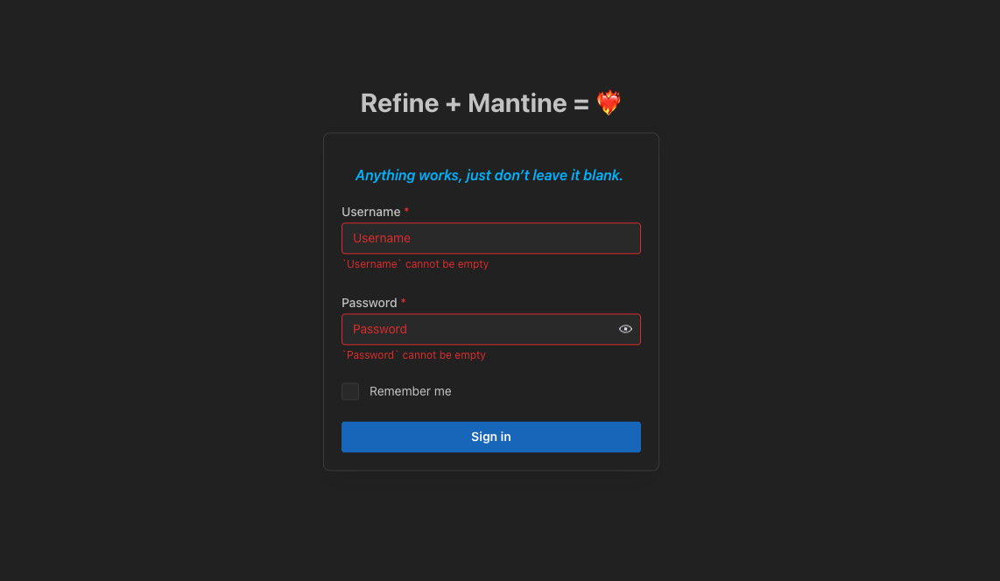

<p align="center">

</p>

# ❤️‍🔥 Refine + Mantine v7

Refine's Mantine integration [only supports Mantine v5](https://refine.dev/docs/ui-integrations/mantine/introduction). This template build on top of [Mantine v7 + Vite template](https://github.com/mantinedev/vite-template), adding:

- Headless Refine v4 integration (based on [this tutorial](https://github.com/refinedev/refine/tree/master/examples/tutorial-headless)).
- Sample resources of `blog-post` and `category`.
- Login page.
- i18n.
- Notification provider.
- `Dockerfile` to deploy via Nginx.




## Features

This template comes with the following features:

- [PostCSS](https://postcss.org/) with [mantine-postcss-preset](https://mantine.dev/styles/postcss-preset)
- [TypeScript](https://www.typescriptlang.org/)
- [Storybook](https://storybook.js.org/)
- [Vitest](https://vitest.dev/) setup with [React Testing Library](https://testing-library.com/docs/react-testing-library/intro)
- ESLint setup with [eslint-config-mantine](https://github.com/mantinedev/eslint-config-mantine)

## npm scripts

## Build and dev scripts

- `dev` – start development server
- `build` – build production version of the app
- `preview` – locally preview production build

### Testing scripts

- `typecheck` – checks TypeScript types
- `lint` – runs ESLint
- `prettier:check` – checks files with Prettier
- `vitest` – runs vitest tests
- `vitest:watch` – starts vitest watch
- `test` – runs `vitest`, `prettier:check`, `lint` and `typecheck` scripts

### Other scripts

- `up:mantine` – upgrade Mantine's packages
- `up:refine` – upgrade Refine's packages
- `storybook` – starts storybook dev server
- `storybook:build` – build production storybook bundle to `storybook-static`
- `prettier:write` – formats all files with Prettier

## Development

### Theming and styling

Mantine@7 offers several approaches of theming and styling. [Learn here](https://mantine.dev/getting-started/#learn).

Mantine@7 also offers a system of CSS variables that you can use them in your stylesheets. To get CSS variables autocomplete and PostCSS support, [follow here to set up your VS Code](https://mantine.dev/getting-started/#set-up-vs-code).

### Change favicon

Favicon and markup for favicon are generated by [favicon-generator](https://www.favicon-generator.org/). To tweak your own image, generate and replace those files:

```sh
public/android-icon-36x36.png
public/android-icon-48x48.png
public/android-icon-72x72.png
public/android-icon-96x96.png
public/android-icon-144x144.png
public/android-icon-192x192.png
public/apple-icon-57x57.png
public/apple-icon-60x60.png
public/apple-icon-72x72.png
public/apple-icon-76x76.png
public/apple-icon-114x114.png
public/apple-icon-120x120.png
public/apple-icon-144x144.png
public/apple-icon-152x152.png
public/apple-icon-180x180.png
public/apple-icon-precomposed.png
public/apple-icon.png
public/browserconfig.xml
public/favicon-16x16.png
public/favicon-32x32.png
public/favicon-96x96.png
public/favicon.ico
public/manifest.json
public/ms-icon-70x70.png
public/ms-icon-144x144.png
public/ms-icon-150x150.png
public/ms-icon-310x310.png
```
